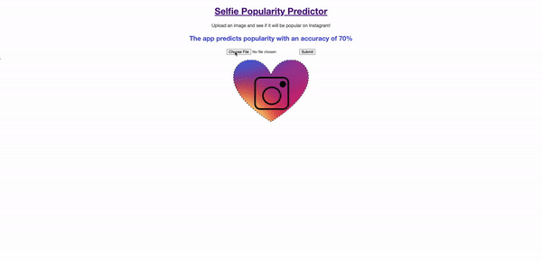

# Selfie Popularity Predictor
The goal of my final project at Metis was to build a classifier which decides if a selfie will be popular on Instagram.

# Data
The [data](https://www.crcv.ucf.edu/data/Selfie/) was collected from a study conducted at the University of Central Florida. 
It contains over 46,000 selfies from Instagram, each containing several interesting label. The one most important for this project
was the log2 normalized popularity score, which I used to determine if a photo was popular or not.

## Image Prep
Each image was 306 by 306 pixels. To improve model performance, I resized them to be 128 by 128.

## Expression Detection
In addition to determining popularity, I wanted to return some information about each photo. 
I used [Facial Expression Recognition](https://pypi.org/project/fer/) (FER) to extract some basic emotions seen in the photos.
Unfortuntately, the emotion data did little to improve the model, but understanding one's expression in a photo could
be helpful for improving popularity.

## Reduction of dataset
I only kept the photos for which expression could be detected by FER. This reduced my dataset to about 19,000 selfies; a number
which I was comfortable with.

## Code and Initial Modeling
The code for my data cleaning and expression detection can be found in `pre_NNet_analysis.ipynb`. 
I also fit some basic classification models, none of which yielded good results, so long as I did not use the image data (pixels).

# Modeling
I used a Convolutional Neural Net, fitting the data to a sequential model. I started on a subset of my photos and once I
was comfortable with the results, I fit the model to my entire dataset. My best validation accuracy was 72%, on a nearly perfectly
balanced dataset, and I achieved an accuracy of 71% on the test set.

## Project Code
The code for my model can be found in `cnn_model.ipynb` as well as the results of my test set.

# Flask App
I built a basic Flask App to display the results of the model. The app takes in an image of any size and returns the probability
of the photo being popular on Instragram as well as the emtions being conveyed in the photo.

## Quick demo of the app

# Conclusion
Given the model's accuracy, the short time I had to work on this, and the subjectivity of the target (popularity) I believe
that this result is surprisingly good. With more computing power, data (perhaps a million photos) and more time, then
it's feasible to think that Instagram popularity can be predicted with a greater accuracy than achieved here.

